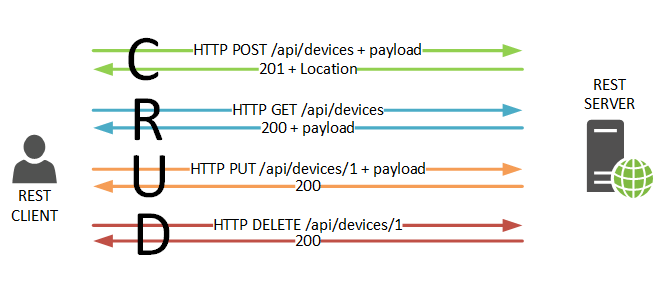
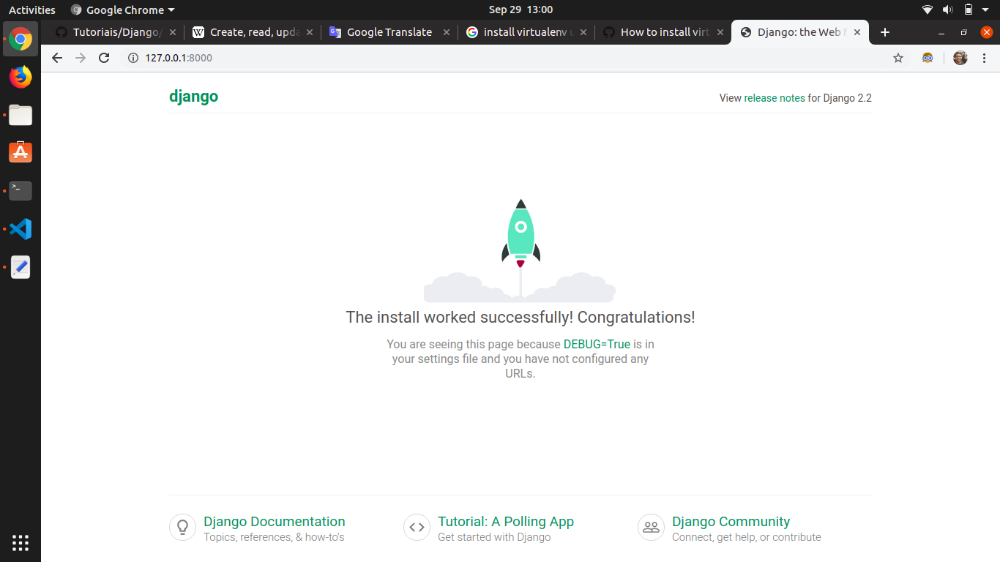
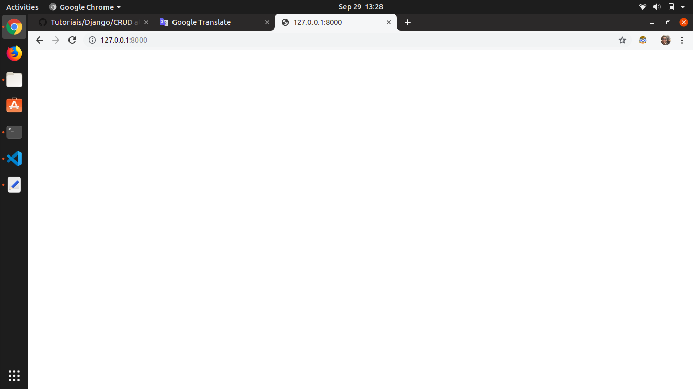
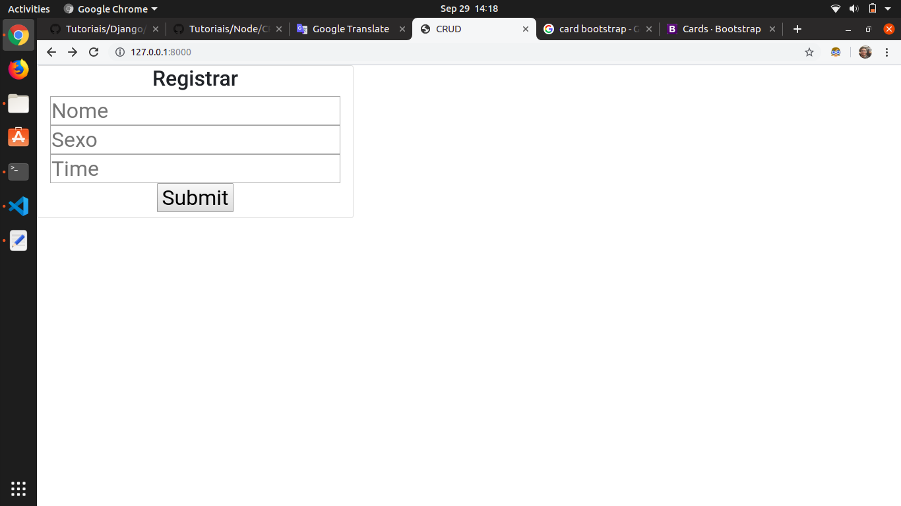

# CRUD



## Apresentação

Na programação de computadores, criar, ler, atualizar e excluir (CRUD) são as quatro funções básicas do armazenamento persistente. As vezes, palavras alternativas são usadas ao definir as quatro funções básicas do CRUD, como recuperar em vez de ler, modificar em vez de atualizar ou destruir em vez de excluir. Às vezes, o CRUD também é usado para descrever convenções de interface do usuário que facilitam a visualização, pesquisa e alteração de informações; frequentemente usando formulários e relatórios baseados em computador.

## Tópicos

### Métodos

1. CREATE
2. READ
3. UPDATE
4. DELETE

## Tutorial

Criaremos um projeto de listagem de torcedores cadastrados. As informações que terão nessa tabela serão:

* Nome
* Sexo
* Time

### Preparando o Ambiente

Antes de iniciar o desenvolvimento do código iremos preparar o ambiente criando a pasta do projeto e entrando nela:

```sh
mkdir torcedores
cd torcedores
```
Dentro dela criaremos um ambiente virtual. Utilizaremos o virtualenv.

```sh
python -m venv venv
```
Agora esecute o comando para ativar o ambiente:
```sh
./venv/bin/activate
```
Com o ambiente virtual, agora instalaremos o Django:
```sh
pip3 install Django
```
Criaremos um projeto Django com o comando:
```sh
django-admin startproject project
```
Você deve ter a seguinte organização de pastas:
```
torcedores/
│
├── project/
│   ├── project/
│   │   ├── __init__.py
│   │   ├── settings.py
│   │   ├── urls.py
│   │   └── wsgi.py
│   │
│   └── manage.py
│
└── venv/
```
A maior parte do trabalho que você faz estará no primeiro diretório `torcedores`. Para evitar a necessidade de fazer o cd através de vários diretórios cada vez que você trabalha no seu projeto e fazer deploys em um host, pode ser útil reordenar isso levemente, movendo todos os arquivos para um diretório. Enquanto você estiver no diretório `torcedores`, execute os seguintes comandos:
```sh
mv project/manage.py ./
mv project/project/* project
rm -r project/project/
```
No final você deve ter essa estrutura:
```
torcedores/
│
├── project/
│   ├── __init__.py
│   ├── settings.py
│   ├── urls.py
│   └── wsgi.py
│
├── venv/
│
└── manage.py
```
Depois que sua estrutura de arquivos estiver configurada, você poderá iniciar o servidor e verificar se sua configuração foi bem-sucedida. No console, execute o seguinte comando:
```shell
python manage.py runserver
```
Vá ao navegador e coloque o IP: 127.0.0.1:8000


Com isso você poderá começar o projeto em Django.

### Iniciando o CRUD

Criaremos uma aplicação em Django chamada CRUD. Nela desenvolveremos nossos métodos.

```sh
python3 manage.py startapp CRUD
```
No app que você criou você precisa instalar no seu projeto. Vá no arquivo project/settings.py e adicione o seguinte código em INSTALLED_APPS:

```python
INSTALLED_APPS = [
    'django.contrib.admin',
    'django.contrib.auth',
    'django.contrib.contenttypes',
    'django.contrib.sessions',
    'django.contrib.messages',
    'django.contrib.staticfiles',
    'CRUD', # Code changed here
]
```

Agora criaremos uma view para exibir algo para o usuário.

No arquivo views.py de CRUD:

```python
from django.shortcuts import render
def index(request):
    return render(request, 'index.html',{})
```
Agora que você criou a função de visualização, é necessário criar o modelo HTML a ser exibido para o usuário. render () procura modelos HTML dentro de um diretório chamado modelos dentro do diretório do aplicativo. Crie esse diretório e, posteriormente, um arquivo chamado index.html dentro dele:
```sh
mkdir CRUD/templates/
touch CRUD/templates/index.html
```
Agora você criou uma função para lidar com suas visualizações e modelos para exibir ao usuário. A etapa final é conectar seus URLs para que você possa visitar a página que acabou de criar. Seu projeto possui um módulo chamado urls.py, no qual você precisa incluir uma configuração de URL para o aplicativo CRUD. Dentro de project/urls.py, adicione o seguinte:
```python
from django.contrib import admin
from django.urls import path, include

urlpatterns = [
    path('admin/', admin.site.urls),
    path('', include('CRUD.urls')),
]
```
O módulo index.urls ainda não existe, então você precisará criá-lo:
```sh
touch CRUD/urls.py
```
Dentro deste módulo, precisamos importar o objeto de caminho, bem como o módulo de visualizações do nosso aplicativo. Em seguida, queremos criar uma lista de padrões de URL que correspondam às várias funções de exibição. No momento, criamos apenas uma função de visualização, portanto, precisamos criar apenas um URL:
```python
from django.urls import path
from CRUD import views

urlpatterns = [
    path('',views.index, name='index'),
]
```
Reiniciando o servidor você verá o modelo em branco criado:



Criaremos um modelo base que podemos importar para cada visualização subsequente. Este modelo é o local onde adicionaremos posteriormente as importações do estilo Bootstrap.
Crie outro diretório chamado templates, desta vez em project, e um arquivo chamado base.html, dentro do novo diretório:

```shell
$ mkdir project/templates/
$ touch project/templates/base.html
```

Dentro deste novo arquivo (project/templates/base.html), adicione as seguintes linhas de código:

```html
<!DOCTYPE html>
<html>
    <head>
        <meta charset="utf-8">
        <title>CRUD</title>
        <link rel="stylesheet" href="https://stackpath.bootstrapcdn.com/bootstrap/4.3.1/css/bootstrap.min.css" integrity="sha384-ggOyR0iXCbMQv3Xipma34MD+dH/1fQ784/j6cY/iJTQUOhcWr7x9JvoRxT2MZw1T" crossorigin="anonymous">
    </head>
    <body>
        
        <script src="https://code.jquery.com/jquery-3.3.1.slim.min.js" integrity="sha384-q8i/X+965DzO0rT7abK41JStQIAqVgRVzpbzo5smXKp4YfRvH+8abtTE1Pi6jizo" crossorigin="anonymous"></script>
        <script src="https://cdnjs.cloudflare.com/ajax/libs/popper.js/1.14.7/umd/popper.min.js" integrity="sha384-UO2eT0CpHqdSJQ6hJty5KVphtPhzWj9WO1clHTMGa3JDZwrnQq4sF86dIHNDz0W1" crossorigin="anonymous"></script>
        <script src="https://stackpath.bootstrapcdn.com/bootstrap/4.3.1/js/bootstrap.min.js" integrity="sha384-JjSmVgyd0p3pXB1rRibZUAYoIIy6OrQ6VrjIEaFf/nJGzIxFDsf4x0xIM+B07jRM" crossorigin="anonymous"></script>
    </body>
</html>
```

Agora, em CRUD/templates/index.html, podemos estender este modelo básico:

```html



<h1>Usando Base</h1>

```
O que acontece aqui é que qualquer HTML dentro do bloco page_content é adicionado dentro do mesmo bloco em base.html.

Antes de podermos ver nosso novo aplicativo estilizado, precisamos informar ao nosso projeto Django que existe base.html. As configurações padrão registram diretórios de modelo em cada aplicativo, mas não no próprio diretório do projeto. Em project/settings.py, atualize TEMPLATES:
```python
TEMPLATES = [
    {
        "BACKEND": "django.template.backends.django.DjangoTemplates",
        "DIRS": ["project/templates/"], # Code changed here
        "APP_DIRS": True,
        "OPTIONS": {
            "context_processors": [
                "django.template.context_processors.debug",
                "django.template.context_processors.request",
                "django.contrib.auth.context_processors.auth",
                "django.contrib.messages.context_processors.messages",
            ]
        },
    }
]
```

Agora, quando você visita localhost: 8000, deve ver que a página:


#### READ

É uma operação executada pelos navegadores sempre que visitamos uma página web. Ao ser iniciada, os navegadores enviam uma solicitação GET ao servidor para executar uma operação de leitura. Isso foi realizado em urls.py.

```python
from django.contrib import admin
from django.urls import path, include

urlpatterns = [
    path('admin/', admin.site.urls),
    path('', include('CRUD.urls')),
]
```

Vamos agora iniciar a parte visual do nosso projeto.

Coloque em index.html o seguinte código:

```html



<div class="card" style="width: 30rem; text-align: center;">
    <h2>Registrar<h2>
    <form action="/show" method="POST">
        <input type="text" placeholder="Nome" name="name">
        <input type="text" placeholder="Sexo" name="sex">
        <input type="text" placeholder="Time" name="team">
        <button type="submit">Submit</button>
    </form>
</div>


```

Você terá a seguinte visualização na tela:



#### CREATE


## Referências

* [en.wikipedia.org](https://en.wikipedia.org/wiki/Create,_read,_update_and_delete)