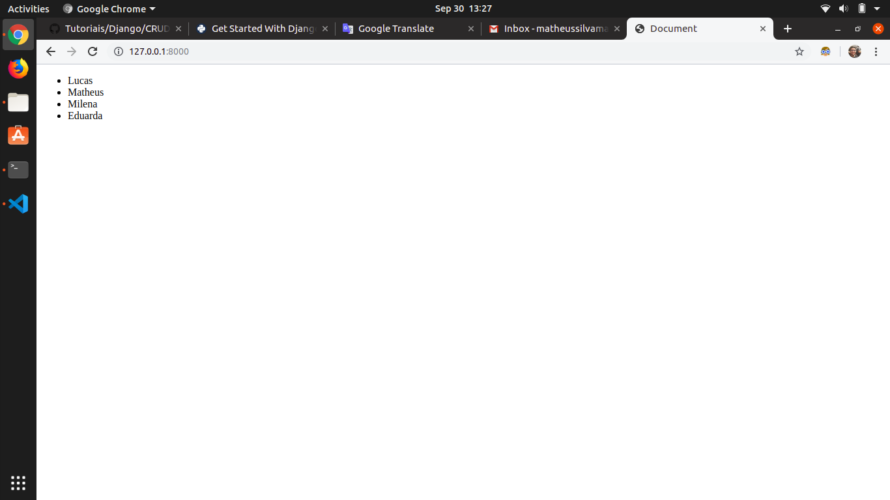
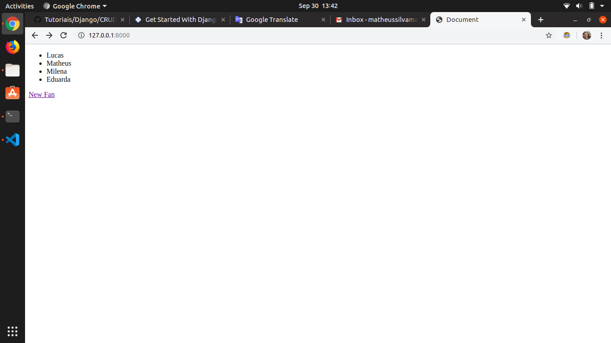
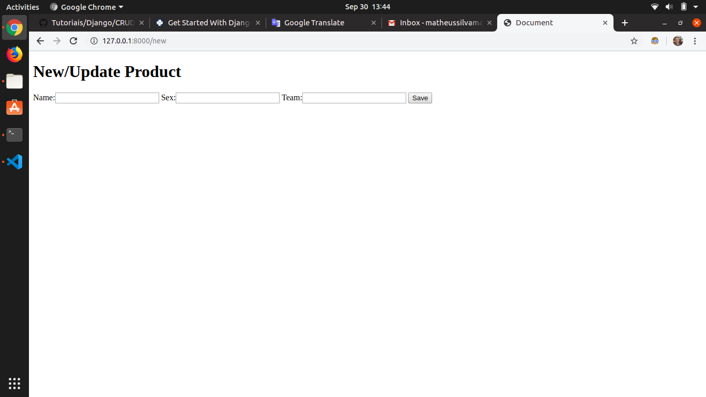
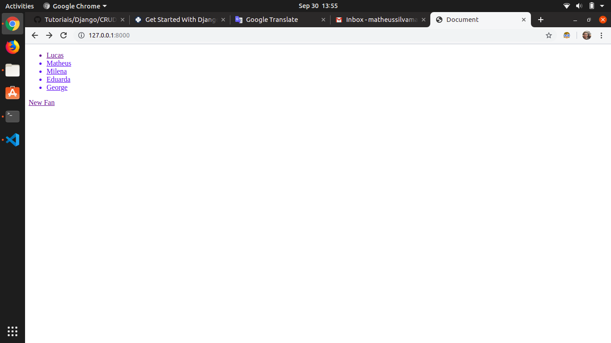
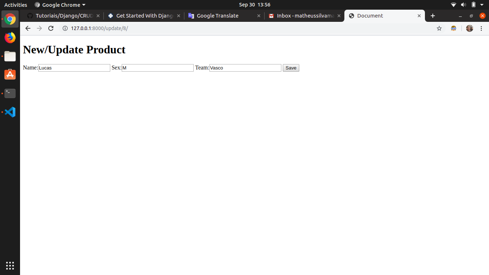

# CRUD


## Apresentação

Na programação de computadores, criar, ler, atualizar e excluir (CRUD) são as quatro funções básicas do armazenamento persistente. As vezes, palavras alternativas são usadas ao definir as quatro funções básicas do CRUD, como recuperar em vez de ler, modificar em vez de atualizar ou destruir em vez de excluir. Às vezes, o CRUD também é usado para descrever convenções de interface do usuário que facilitam a visualização, pesquisa e alteração de informações; frequentemente usando formulários e relatórios baseados em computador.

## Tópicos

### Métodos

1. CREATE
2. READ
3. UPDATE
4. DELETE

## Tutorial

Criaremos um projeto de listagem de torcedores cadastrados. As informações que terão nessa tabela serão:

* Nome
* Sexo
* Time

### Preparando o Ambiente

Antes de iniciar o desenvolvimento do código iremos preparar o ambiente criando a pasta do projeto e entrando nela:

```sh
mkdir torcedores
cd torcedores
```
Dentro dela criaremos um ambiente virtual. Utilizaremos o virtualenv.

```sh
python -m venv venv
```
Agora esecute o comando para ativar o ambiente:
```sh
./venv/bin/activate
```
Com o ambiente virtual, agora instalaremos o Django:
```sh
pip3 install Django
```
Criaremos um projeto Django com o comando:
```sh
django-admin startproject project
```
Você deve ter a seguinte organização de pastas:
```
torcedores/
│
├── project/
│   ├── project/
│   │   ├── __init__.py
│   │   ├── settings.py
│   │   ├── urls.py
│   │   └── wsgi.py
│   │
│   └── manage.py
│
└── venv/
```
A maior parte do trabalho que você faz estará no primeiro diretório `torcedores`. Para evitar a necessidade de fazer o cd através de vários diretórios cada vez que você trabalha no seu projeto e fazer deploys em um host, pode ser útil reordenar isso levemente, movendo todos os arquivos para um diretório. Enquanto você estiver no diretório `torcedores`, execute os seguintes comandos:
```sh
mv project/manage.py ./
mv project/project/* project
rm -r project/project/
```
No final você deve ter essa estrutura:
```
torcedores/
│
├── project/
│   ├── __init__.py
│   ├── settings.py
│   ├── urls.py
│   └── wsgi.py
│
├── venv/
│
└── manage.py
```
Depois que sua estrutura de arquivos estiver configurada, você poderá iniciar o servidor e verificar se sua configuração foi bem-sucedida. No console, execute o seguinte comando:
```shell
python manage.py runserver
```
Vá ao navegador e coloque o IP: 127.0.0.1:8000


Com isso você poderá começar o projeto em Django.

### Criação do App

Criaremos uma aplicação em Django chamada CRUD. Nela desenvolveremos nossos métodos.

```sh
python3 manage.py startapp CRUD
```
No app que você criou você precisa instalar no seu projeto. Vá no arquivo project/settings.py e adicione o seguinte código em INSTALLED_APPS:

```python
INSTALLED_APPS = [
    'django.contrib.admin',
    'django.contrib.auth',
    'django.contrib.contenttypes',
    'django.contrib.sessions',
    'django.contrib.messages',
    'django.contrib.staticfiles',
    'CRUD', # Code changed here
]
```

### Criação de Molelos e Dados

Agora, criaremos uma modelo em Django para podermos construir a lista de torcedores.

No arquivo models.py coloque o código:

```python
from django.db import models

class Fan(models.Model):
    name = models.CharField(max_length=100)
    sex = models.CharField(max_length=100)
    team = models.CharField(max_length=100)

    def __str__(self):
        return self.name
```

Veja que criamos uma classe chamada `Fan` que possui o nome do torcedor, o sexo do torcedor e o time do torcedor.

Além disso, criamos a função construtora `__str__` que retorna o nome do usuário cadastrado.

Também construíremos outro modelo para cadastrar o usuário utilizando um formuário.

Na pasta CRUD crie o arquivo forms.py:

```sh
touch CRUD/forms.py
```

Dentro dessa pasta coloque o código:

```python
from django import forms
from .models import Fan

class FanForm(forms.ModelForm):
    class Meta:
        model = Fan
        fields = ['name','sex','team']
```

O que acabamos de criar foi uma classe `FanForm` que terá todas as informações da classe `Fan` por meio da classe `Meta`. Ou seja, meta dados criados que possuem nome, sexo e time do torcedor.

Para as classes serem usadas no projeto em Django como um modelo SQL, devemos fazer uma migração das informaçẽos com os comandos:

```sh
python manage.py makemigrations CRUD
ython manage.py migrate
```

Com isso você terá tabelas criadas e migradas para o seu banco de dados, que no caso o padrão usado no Django é o `db.sqlite3`.

Para criar instâncias da nossa classe Fan, teremos que usar o shell do Django. O shell do Django é semelhante ao shell do Python, mas permite acessar o banco de dados e criar entradas. Para acessar o shell do Django, usamos outro comando de gerenciamento do Django:

No terminal, digite o comando:

```sh
python manage.py shell
```

Depois de acessar o shell, você notará que o prompt de comando mudará de $ para >>>. Você pode importar seus modelos:

```sh
from CRUD.models import Fan
```

Criaremos usuários com os seguintes atributos:

name | sex | team
---- | --- | ----
Lucas | M | Vasco
Matheus | M | Flamengo
Milena | F | Coríntias
Eduarda | F | Fortaleza

```sh
>>> p1 = Fan(
...     name='Lucas',
...     sex='M',
...     team='Vasco'
... )
>>> p1.save()
>>> p2 = Fan(
...     name='Matheus',
...     sex='M',
...     team='Flamengo'
... )
>>> p2.save()
>>> p3 = Fan(
...     name='Milena',
...     sex='F',
...     team='Coríntias'
... )
>>> p3.save()
>>> p4 = Fan(
...     name='Eduarda',
...     sex='F',
...     team='Fortaleza'
... )
>>> p4.save()
```

Agora que possuímos um modelo de dados e dados de pessoas nele será criado os métodos do CRUD.

### Iniciando o CRUD

#### READ

Para termos uma visualização dos dados vamos criar no arquivo urls.py de CRUD o caminho para fazer a listagem de elementos.

Coloque o código em urls.py:

```python
from django.urls import path
from .views import list_fans

urlpatterns = [
    path('',list_fans, name='list_fans'),
]
```

Agora vamos criar em views.py a função de visualização:

```python
from django.shortcuts import render
from .models import Fan

def list_fans(request):
    fans = Fan.objects.all()
    context = {
        'fans':fans
    }
    return render(request,'fans.html', context)
```

Veja que fazemos a importação da classe Fan, depois pegamos todos os elementos com `objects.all()` e depois colocamos essas informaçẽos em um JSON. Ao final, renderizamos uma página mandando as informaçãos do JSON.

Crie a página `fans.html` em templates e coloque o seguinte código:
```sh
touch CRUD/templates/fans.html
```
```html
<!DOCTYPE html>
<html lang="en">
    <head>
        <meta charset="UTF-8">
        <meta name="viewport" content="width=device-width, user-scalable=no, initial-scale=1.0, maximum-scale=1.0, minimum-scale=1.0">
        <meta http-equiv="X-UA-Compatible" content="ie=edge">
        <title>Document</title>
    </head>
    <body>
        <ul>
            
                <li>{{fan.name}}</li>
            
        </ul>
    </body>
</html>
```

Você deve ter a seguinte visualização:



Veja que utilizamos um ciclo `for` para a visualização de todos os dados:

```django

    <li>{{fan.name}}</li>

```

#### CREATE

Para criar usuários vamos colocar um novo caminho em urls.py:

```python
from django.urls import path
from .views import create_fan, list_fans

urlpatterns = [
    path('',list_fans, name='list_fans'),
    path('new', create_fan, name='create_fan'),
]
```

Agora criaremos um função de criação de usuários em views.py:

```python
from django.shortcuts import render, redirect
from .models import Fan
from .forms import FanForm

def create_fan(request):
    form = FanForm(request.POST or None)

    if form.is_valid():
        form.save()
        return redirect(list_fans)
    context={
        'form':form
    }
    return render(request,'fans-form.html',context)
```

Veja que importamos a classe `FanForm` e o método `redirect`. A cração de usuários se baseia em uma pessoas preencher um formulário e os dados do formulário serem mandados para uma página, que no nosso caso é `new`. Os dados são obtidos em `anForm(request.POST or None)`. Se o formulário é válido, então as informações são salvas no banco de dados e depois redirecionamos o cliente para a página de visualização. Caso haja algum problema no formulário, o cliente deverá preencher as informaçẽos novamente.

Para o formulário criaremos o fans-form.html:

```
touch CRUD/templates/fans-form.html
```

Nesse arquivo criado coloque o código:

```html
<!DOCTYPE html>
<html lang="en">
    <head>
        <meta charset="UTF-8">
        <meta name="viewport" content="width=device-width, user-scalable=no, initial-scale=1.0, maximum-scale=1.0, minimum-scale=1.0">
        <meta http-equiv="X-UA-Compatible" content="ie=edge">
        <title>Document</title>
    </head>
    <body>
        <h1>New/Update Product</h1>
        <form method="POST">
            
            {{form}}
            <button type="submit">Save</button>
        </form>
    </body>
</html>
```

Para a melhor interação com as páginas, coloque no final da tag `ul`, em `fans.html`, o código:

```html
<a href="">New Fan</a>
```

Você terá para `fans.html`:



Se você clicar no botão New Fan, será direcionado para a página:



Se preenche o formulário você verá que estará adicionando elementos.

### UPDATE

Para criar usuários vamos colocar um novo caminho em urls.py:

```python
from django.urls import path
from .views import create_fan, update_fan, list_fans

urlpatterns = [
    path('',list_fans, name='list_fans'),
    path('new', create_fan, name='create_fan'),
    path('update/<int:id>/',update_fan, name='update_fan')
]
```

Criaremos a função update em views.py:

```python
def update_fan(request, id):
    fan = Fan.objects.get(id=id)
    form = FanForm(request.POST or None, instance=fan)
    if form.is_valid():
        form.save()
        return redirect('list_fans')
    context={
        'form':form,
        'fan':fan
    }
    return render(request,'fans-form.html', context)
```

Veja que precisamos de duas variáveis: fan e form. A primeira foi obtida com o `id`, já a segunda seria para fazer uma alteração dos dados de fan.

Com as alteraçẽos feitas, o usuário seria direcionado para a listagem. Já sem alterações o usuário seria direcionado para alterar dados.

Altere o código de `fans.html`:

```html
<!DOCTYPE html>
<html lang="en">
    <head>
        <meta charset="UTF-8">
        <meta name="viewport" content="width=device-width, user-scalable=no, initial-scale=1.0, maximum-scale=1.0, minimum-scale=1.0">
        <meta http-equiv="X-UA-Compatible" content="ie=edge">
        <title>Document</title>
    </head>
    <body>
        <ul>
            
            <a href="">
                <li>{{fan.name}}</li>
            </a>
            
        </ul>
        <a href="">New Fan</a>
    </body>
</html>
```

Agora, quando o usuário apertar no nome de algum usuário ele mandará uma resposta para uma página de alteração de dados.

Na página principal, teremos:



Se apertarmos em um dos usuários, teremos:



Com isso, conseguimos alterar os dados do usuário.

#### DELETE

Para criar usuários vamos colocar um novo caminho em urls.py:

```python
from django.urls import path
from .views import create_fan, update_fan, delete_fan, list_fans

urlpatterns = [
    path('',list_fans, name='list_fans'),
    path('new', create_fan, name='create_fan'),
    path('update/<int:id>/',update_fan, name='update_fan'),
    path('delete/<int:id>/',delete_fan, name='delete_fan'),
]
```

Criaremos a função de deleção em views.py:

```python
def delete_fan(request, id):
    fan = Fan.objects.get(id=id)
    if request.method == 'POST':
        fan.delete()
        return redirect('list_fans')
    context = {
        'fan':fan
    }
    return render(request,'fan-delete-confirm.html',context)
```

Para esse método pegamos o `fan` pelo `id`. Se a requisição foi do tipo POST, então o fan é deletado e o usuário é redirecionado para a listagem de usuários.

Caso não haja requisição, será direcionado para uma página de confirmação de deleção.

Crie o arquivo `fan-delete-confirm.html`:

```sh
touch CRUD/templates/fan-delete-confirm.html
```

Coloque o seguinte código no html criado:

```html
<!DOCTYPE html>
<html lang="en">
    <head>
        <meta charset="UTF-8">
        <meta name="viewport" content="width=device-width, user-scalable=no, initial-scale=1.0, maximum-scale=1.0, minimum-scale=1.0">
        <meta http-equiv="X-UA-Compatible" content="ie=edge">
        <title>Document</title>
    </head>
    <body>
        <form method="POST">
            
            <h2>Are you sure you want to remove {{fan.name}} ?</h2>
            <button type="submit">Confirm</button>
        </form>
    </body>
</html>
```

Para melhorar a interação com as páginas, coloque em fans-form.html o seguinte código:

```html
<!DOCTYPE html>
<html lang="en">
    <head>
        <meta charset="UTF-8">
        <meta name="viewport" content="width=device-width, user-scalable=no, initial-scale=1.0, maximum-scale=1.0, minimum-scale=1.0">
        <meta http-equiv="X-UA-Compatible" content="ie=edge">
        <title>Document</title>
    </head>
    <body>
        <h1>New/Update Product</h1>
        <form method="POST">
            
            {{form}}
            <button type="submit">Save</button>
        </form>

        
        <a href="">Delete</a>
        
    </body>
</html>
```

Com isso, você poderá excluir usuários da sua listagem de torcedores.

## Referências

* [en.wikipedia.org](https://en.wikipedia.org/wiki/Create,_read,_update_and_delete)