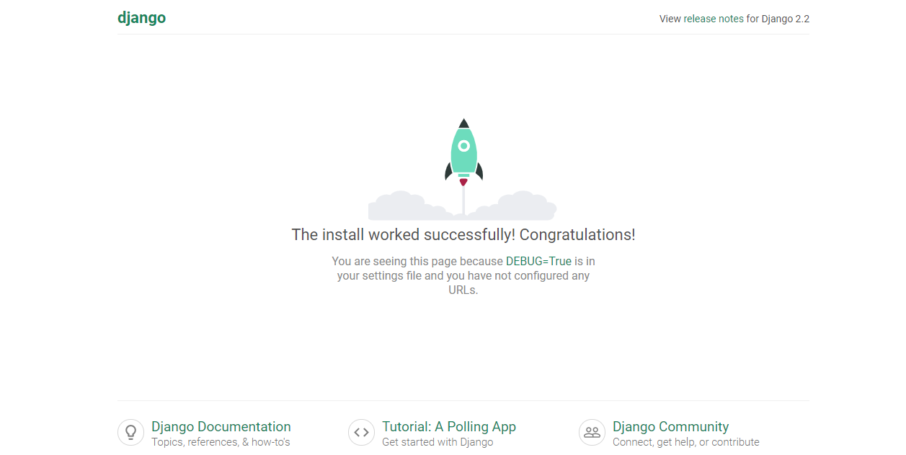

 # Tutorial de Django


## Apresentação

Neste tutorial apresentarei algumas funcionalidades básicas do Django. O objetivo será fazer um Hello World usando Django.

## Tópicos Abordados

    1. Trabalhar com ambientes virtuais
    2. Criar um projeto com Django
    3. Criar uma aplicação em Django
    4. Utilizar views
    5. Renderizar templates básicos

## Tutorial

### Ambiente Virtual
Projetos em python costumam ser difíceis de serem realizados sem a presença de um ambiente virtual, pois há versões do python para cada projeto realizado. Por isso, é recomendado utilizar um abiente virtual antes de realizar qualquer projeto em python. A ferramenta que utilizaremos para fazer isso será o virtualenv.

Vamos criar a pasta do nosso projeto.
```shell
$ mkdir project
$ cd project
```
Agora vamos utilizar o virtualenv para criar um ambiente dentro do nosso projeto.
Estaremos utilizando p python 3.6.0.
```shell
$ python -m venv venv
```
Este comando criará uma pasta venv no seu diretório de trabalho. Dentro deste diretório, você encontrará vários arquivos, incluindo uma cópia da biblioteca padrão do Python. Mais tarde, quando você instala novas dependências, elas também serão armazenadas neste diretório. Em seguida, você precisa ativar o ambiente virtual executando o seguinte comando:
```shell
$ venv/Scripts/activate.bat
```
### Começando com Django
Agora instalaremos o Django.
```shell
$ pip install Django
```
Criaremos o projeto Django com o comando:
```shell
$ django-admin startproject project
```
Isso criará um novo diretório project. Se você entrar nesse novo diretório, verá outro diretório chamado project e um arquivo chamado manage.py. Sua estrutura de diretórios deve se parecer com isso:
```
project/
│
├── project/
│   ├── project/
│   │   ├── __init__.py
│   │   ├── settings.py
│   │   ├── urls.py
│   │   └── wsgi.py
│   │
│   └── manage.py
│
└── venv/
```
A maior parte do trabalho que você faz estará no primeiro diretório project. Para evitar a necessidade de fazer o cd através de vários diretórios cada vez que você trabalha no seu projeto e fazer deploys em um host, pode ser útil reordenar isso levemente, movendo todos os arquivos para um diretório. Enquanto você estiver no diretório project, execute os seguintes comandos:
```shell
$ mv project/manage.py ./
$ mv project/project/* project
$ rm -r project/project/
```
No final você deve ter essa estrutura:
```
project/
│
├── project/
│   ├── __init__.py
│   ├── settings.py
│   ├── urls.py
│   └── wsgi.py
│
├── venv/
│
└── manage.py
```
Depois que sua estrutura de arquivos estiver configurada, você poderá iniciar o servidor e verificar se sua configuração foi bem-sucedida. No console, execute o seguinte comando:
```shell
$ python manage.py runserver
```
Vá ao navegador e coloque o IP: 127.0.0.1:8000

Com isso você poderá começar o projeto em Django.
### Criar uma Aplicação em Django
Para nossa primeira aplicação trabalharemos com o projeto Hello World.
No terminal vamos criar uma aplicação:
```shell
$ python manage.py startapp hello_world
```
No app que você criou você precisa instalar no seu projeto. Vá no arquivo project/settings.py e adicione o seguinte código em INSTALLED_APPS:
```python
INSTALLED_APPS = [
    'django.contrib.admin',
    'django.contrib.auth',
    'django.contrib.contenttypes',
    'django.contrib.sessions',
    'django.contrib.messages',
    'django.contrib.staticfiles',
    'hello_world', # Code changed here
]
```
Na linha do código você está dizendo ao seu projeto sobre o app criado. A próxima etapa é criar uma view para que você possa exibir algo para o usuário.

Views em Django são uma coleção de funções ou classes dentro de views.py no diretório de app. Cada função ou classe possui um processo lógico para cada URL visitada.
No arquivo views.py de hello_world:
```python
from django.shortcuts import render
def hello_world(request):
    return render(request, 'hello_world.html',{})
```
Neste pedaço de código, você definiu uma função de visualização chamada hello_world (). Quando essa função é chamada, ela renderiza um arquivo HTML chamado hello_world.html. Esse arquivo ainda não existe, mas vamos criá-lo em breve.

A função view aceita um argumento, request. Este objeto é um HttpRequestObject que é criado sempre que uma página é carregada. Ele contém informações sobre a solicitação, como o método, que pode assumir vários valores, incluindo GET e POST.

Agora que você criou a função de visualização, é necessário criar o modelo HTML a ser exibido para o usuário. render () procura modelos HTML dentro de um diretório chamado modelos dentro do diretório do aplicativo. Crie esse diretório e, posteriormente, um arquivo chamado hello_world.html dentro dele:
```shell
$ mkdir hello_world/templates/
$ touch hello_world/templates/hello_world.html
```
Adicione a linha no html:
* hello_world.html
```html
<h1>Hello World</h1>
```
Agora você criou uma função para lidar com suas visualizações e modelos para exibir ao usuário. A etapa final é conectar seus URLs para que você possa visitar a página que acabou de criar. Seu projeto possui um módulo chamado urls.py, no qual você precisa incluir uma configuração de URL para o aplicativo hello_world. Dentro de project/urls.py, adicione o seguinte:
```python
from django.contrib import admin
from django.urls import path, include

urlpatterns = [
    path('admin/', admin.site.urls),
    path('', include('hello_world.urls')),
]
```
Isso procura por um módulo chamado urls.py dentro do aplicativo hello_world e registra quaisquer URLs definidos lá. Sempre que você visitar o caminho raiz do seu URL (localhost: 8000), os URLs do aplicativo hello_world serão registrados. O módulo hello_world.urls ainda não existe, então você precisará criá-lo:
```shell
$ touch hello_world/urls.py
```
Dentro deste módulo, precisamos importar o objeto de caminho, bem como o módulo de visualizações do nosso aplicativo. Em seguida, queremos criar uma lista de padrões de URL que correspondam às várias funções de exibição. No momento, criamos apenas uma função de visualização, portanto, precisamos criar apenas um URL:
```python
from django.urls import path
from hello_world import views

urlpatterns = [
    path('hello_world',views.hello_world, name='hello_world'),
]
```

Agora, quando você reiniciar o servidor e visitar localhost: 8000/hello_world, poderá ver o modelo HTML criado:


### Criação de um Arquivo Base para Estilos

Criaremos um modelo base que podemos importar para cada visualização subseqüente. Este modelo é o local onde adicionaremos posteriormente as importações do estilo Bootstrap.
Crie outro diretório chamado templates, desta vez em project, e um arquivo chamado base.html, dentro do novo diretório:
```shell
$ mkdir project/templates/
$ touch project/templates/base.html
```
Criamos esse diretório de modelos adicionais para armazenar modelos HTML que serão usados em todos os aplicativos Django no projeto. Como você viu anteriormente, cada projeto Django pode consistir em vários aplicativos que lidam com lógica separada, e cada aplicativo contém seu próprio diretório de modelos para armazenar modelos HTML relacionados ao aplicativo.

Essa estrutura de aplicativos funciona bem para a lógica de back-end, mas queremos que todo o site pareça consistente no front-end. Em vez de precisar importar estilos de Bootstrap para todos os aplicativos, podemos criar um modelo ou conjunto de modelos compartilhados por todos os aplicativos. Enquanto o Django souber procurar modelos nesse novo diretório compartilhado, ele poderá salvar muitos estilos repetidos.

Dentro deste novo arquivo (project/templates/base.html), adicione as seguintes linhas de código:
```html
<!DOCTYPE html>
<html>
    <head>
        <meta charset="utf-8">
        <title>Hello World</title>
        <link rel="stylesheet" href="https://stackpath.bootstrapcdn.com/bootstrap/4.3.1/css/bootstrap.min.css" integrity="sha384-ggOyR0iXCbMQv3Xipma34MD+dH/1fQ784/j6cY/iJTQUOhcWr7x9JvoRxT2MZw1T" crossorigin="anonymous">
    </head>
    <body>
        
        <script src="https://code.jquery.com/jquery-3.3.1.slim.min.js" integrity="sha384-q8i/X+965DzO0rT7abK41JStQIAqVgRVzpbzo5smXKp4YfRvH+8abtTE1Pi6jizo" crossorigin="anonymous"></script>
        <script src="https://cdnjs.cloudflare.com/ajax/libs/popper.js/1.14.7/umd/popper.min.js" integrity="sha384-UO2eT0CpHqdSJQ6hJty5KVphtPhzWj9WO1clHTMGa3JDZwrnQq4sF86dIHNDz0W1" crossorigin="anonymous"></script>
        <script src="https://stackpath.bootstrapcdn.com/bootstrap/4.3.1/js/bootstrap.min.js" integrity="sha384-JjSmVgyd0p3pXB1rRibZUAYoIIy6OrQ6VrjIEaFf/nJGzIxFDsf4x0xIM+B07jRM" crossorigin="anonymous"></script>
    </body>
</html>
```
Agora, em hello_world/templates/hello_world.html, podemos estender este modelo básico:
```html



<h1>Hello, World!</h1>

```
O que acontece aqui é que qualquer HTML dentro do bloco page_content é adicionado dentro do mesmo bloco em base.html.

Antes de podermos ver nosso novo aplicativo estilizado, precisamos informar ao nosso projeto Django que existe base.html. As configurações padrão registram diretórios de modelo em cada aplicativo, mas não no próprio diretório do projeto. Em project/settings.py, atualize TEMPLATES:
```python
TEMPLATES = [
    {
        "BACKEND": "django.template.backends.django.DjangoTemplates",
        "DIRS": ["project/templates/"], # Code changed here
        "APP_DIRS": True,
        "OPTIONS": {
            "context_processors": [
                "django.template.context_processors.debug",
                "django.template.context_processors.request",
                "django.contrib.auth.context_processors.auth",
                "django.contrib.messages.context_processors.messages",
            ]
        },
    }
]
```
Agora, quando você visita localhost: 8000/hello_world, deve ver que a página foi formatada com um estilo um pouco diferente:


## Referências

* [realpython.com](https://realpython.com/get-started-with-django-1/)
* [docs.djangoproject.com](https://docs.djangoproject.com/en/2.2/)
* [ohmycode.com.br](https://ohmycode.com.br/2017/09/10/cadastro-e-autenticacao-de-usuarios-no-django.html)
