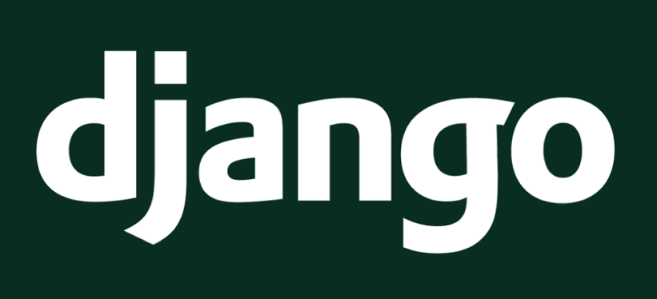

# Tutorial de Django

## Apresentação

O Django é uma estrutura da Web livre e de código aberto baseada em Python, que segue o padrão de arquitetura MTV (model-template-view).
O objetivo principal do Django é facilitar a criação de sites complexos e direcionados a bancos de dados. A estrutura enfatiza a reutilização e a conectividade dos componentes, menos código, baixo acoplamento, desenvolvimento rápido e o princípio de não se repetir. O Python é usado por toda parte, mesmo para arquivos de configurações e modelos de dados.

## Sites que incluem Django

## Tópicos Abordados

    1. 

## Tutorial

## Referências

* [realpython.com](https://realpython.com/get-started-with-django-1/)
* [docs.djangoproject.com](https://docs.djangoproject.com/en/2.2/)