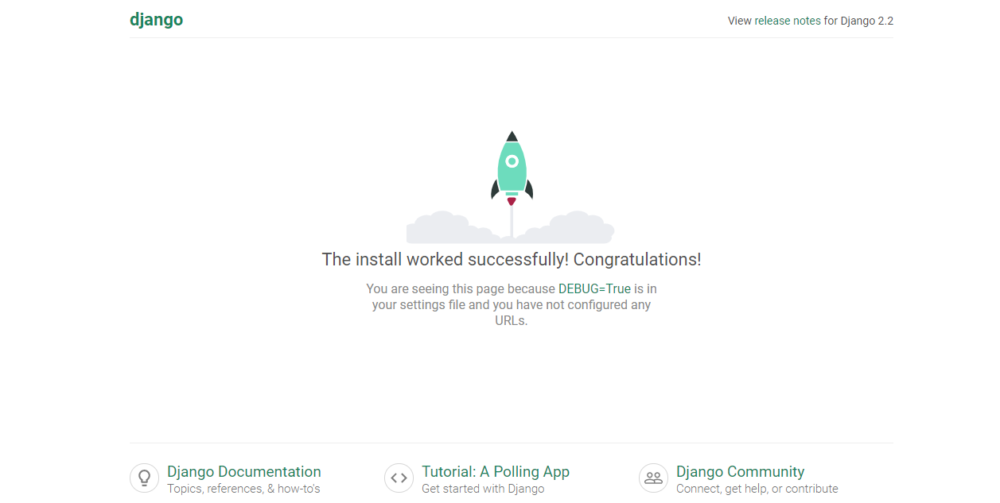

# Tutorial de Django


## Apresentação

O Django é uma estrutura da Web livre e de código aberto baseada em Python, que segue o padrão de arquitetura MTV (model-template-view).
O objetivo principal do Django é facilitar a criação de sites complexos e direcionados a bancos de dados. A estrutura enfatiza a reutilização e a conectividade dos componentes, menos código, baixo acoplamento, desenvolvimento rápido e o princípio de não se repetir. O Python é usado por toda parte, mesmo para arquivos de configurações e modelos de dados.

## Sites que incluem Django


## Tópicos Abordados

    1. 

## Instâncias do Projeto

* [python3](https://www.python.org/)

* [pip](https://pypi.org/project/pip/)

* [virtualenv](https://virtualenv.pypa.io/en/latest/)

## Tutorial

### Ambiente Virtual
Projetos em python costumam ser difíceis de serem realizados sem a presença de um ambiente virtual, pois há versões do python para cada projeto realizado. Por isso, é recomendado utilizar um abiente virtual antes de realizar qualquer projeto em python. A ferramenta que utilizaremos para fazer isso será o virtualenv.

Vamos criar a pasta do nosso projeto.
```shell
$ mkdir project
$ cd project
```
Agora vamos utilizar o virtualenv para criar um ambiente dentro do nosso projeto.
Estaremos utilizando p python 3.6.0.
```shell
$ python -m venv venv
```
Este comando criará uma pasta venv no seu diretório de trabalho. Dentro deste diretório, você encontrará vários arquivos, incluindo uma cópia da biblioteca padrão do Python. Mais tarde, quando você instala novas dependências, elas também serão armazenadas neste diretório. Em seguida, você precisa ativar o ambiente virtual executando o seguinte comando:
```shell
$ venv/Scripts/activate.bat
```
Agora instalaremos o Django.
```shell
$ pip install Django
```
Criaremos o projeto Django com o comando:
```shell
$ django-admin startproject project
```
Isso criará um novo diretório project. Se você entrar nesse novo diretório, verá outro diretório chamado project e um arquivo chamado manage.py. Sua estrutura de diretórios deve se parecer com isso:
```
project/
│
├── project/
│   ├── project/
│   │   ├── __init__.py
│   │   ├── settings.py
│   │   ├── urls.py
│   │   └── wsgi.py
│   │
│   └── manage.py
│
└── venv/
```
A maior parte do trabalho que você faz estará no primeiro diretório project. Para evitar a necessidade de fazer o cd através de vários diretórios cada vez que você trabalha no seu projeto e fazer deploys em um host, pode ser útil reordenar isso levemente, movendo todos os arquivos para um diretório. Enquanto você estiver no diretório project, execute os seguintes comandos:
```shell
$ mv project/manage.py ./
$ mv project/project/* project
$ rm -r project/project/
```
No final você deve ter essa estrutura:
```
project/
│
├── project/
│   ├── __init__.py
│   ├── settings.py
│   ├── urls.py
│   └── wsgi.py
│
├── venv/
│
└── manage.py
```
Depois que sua estrutura de arquivos estiver configurada, você poderá iniciar o servidor e verificar se sua configuração foi bem-sucedida. No console, execute o seguinte comando:
```shell
$ python manage.py runserver
```
Vá ao navegador e coloque o IP: 127.0.0.1:8000

Com isso você poderá começar o projeto em Django.

## Referências

* [realpython.com](https://realpython.com/get-started-with-django-1/)
* [docs.djangoproject.com](https://docs.djangoproject.com/en/2.2/)