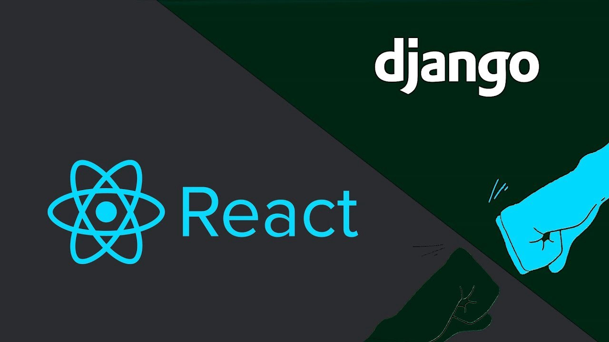

# React com Django



## Apresentação

React é uma **biblioteca JavaScript** declarativo, eficiente e flexível para a criação de interfaces de usuário(UI).

Dizer que React é uma biblioteca significa que é constituído por uma coleção de funcionalidades relacionadas que podem ser chamadas pelo desenvolvedor para resolver problemas específicos.

No React, sua única e principal funcionalidade é a criação de interfaces de usuário, que organiza o que será mostrado para o usuário  final.

## Tutorial

### Setup

A primeira coisa a ser feita é ter um ambiente virtual, no caso usaremos o `virtulenv` para controlar as versões do python.

Para o projeto vamos criar a pasta do projeto, que se chamará `proj`:

```sh
mkdir proj
cd proj
```
Dentro desta pasta, criaremos o ambiente virtual:

```sh
python3 -m venv venv
```
Agora ativaremos o ambiente virtual pelo terminal.
```sh
cd venv/ && source bin/activate
```

Agora vamos instalar as dependẽncias do Django REST framework.

```sh
pip install Django djangorestframework
```
Quando a instalação for concluída iniciaremos um novo projeto em Django.

```sh
django-admin startproject proj
```

## Referências


