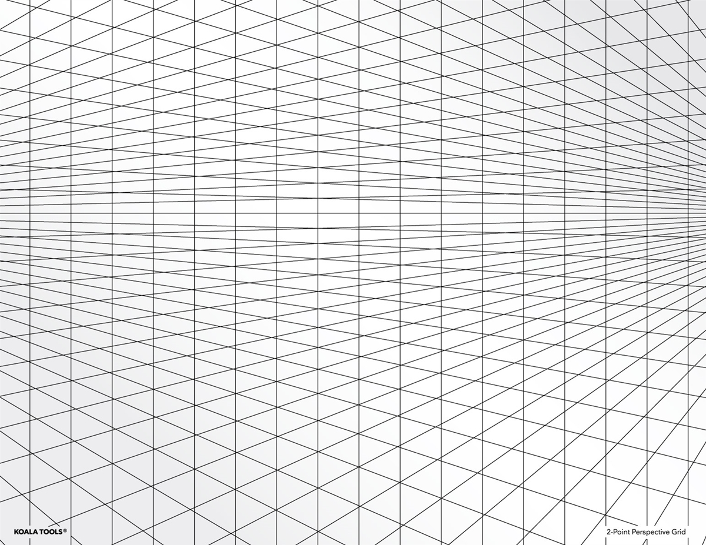

# Grid

## Apresentação

O CSS Grid Layout se destaca pela divisão de uma página nas principais regiões ou pela definição do relacionamento em termos de tamanho, posição e camada, entre partes de um controle criado a partir de primitivas HTML.

Como as tabelas, o layout da grid permite que um desenvolvedor alinhe elementos em colunas e linhas. No entanto, muito mais layouts são possíveis ou mais fáceis com a grade CSS do que com as tabelas. Por exemplo, os elementos filhos de um contêiner de grade podem se posicionar para que se sobreponham e se sobreponham, de maneira semelhante aos elementos posicionados em CSS.

## Referências

* [developer.mozilla.org](https://developer.mozilla.org/en-US/docs/Web/CSS/CSS_Grid_Layout)