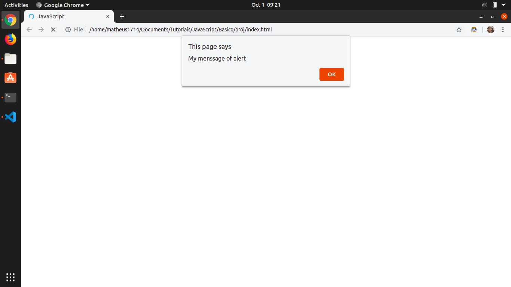

# Básico de JavaScript

## Tutorial

O JavaScript é uma linguagem de client-side. Ela é utilizada para controlar elementos HTML e CSS. Um comportamento comum é o de apertar botões e ser redirecionado para outra página.

### Camadas

Além disso, essa linguagem é um dos elementos do desenvolvimento separado em camadas.

Existem 3 camadas básicas no desenvolvimento para web:

Nível  | Camada     | Função
-- | ---------  | --------
1  | HTML       | marcação
2  | CSS        | formatação
3  | JavaScript | comportamento

Veja que o JavaScript corresponde à terceira camada do desenvolvimento. Ela é responsável por manipular as outras duas camadas, HTML e CSS. 

Quando você carrega uma página  no navegador, você está executando seu código(HTMl, CSS e JavaScript) dentro de um ambiente de execução.

O sistema funciona como uma fábrica que pega matéria prima(código) e transforma em um produto(página web).

O JavaScript é executada pelo motor de renderização do navegado, depois que o HTML e o CSS forem traduzidos e colocados juntos em uma página web. Isso assegura que a estrutura e estilo da página já estão no lugar na hora em que o JavaScript for executado.

Cada guia do navegador tem seu próprio espaço de executar código(ambientes de execução). Isso significa que na maioria dos casos o código em cada guia está sendo executado separadamente, e o código em um guia não altera o código em outro guia.

Quando o navegador encontra um bloco de código JavaScript, ele geralmente executa na ordem na qual vocẽ coloca as informações.

Considere o exemplo de printar algo no DOM:

```js
console.log("Bloco 1")
console.log("Bloco 2")
```

Nesse exemplo o bloco é executado em ordem. `console.log` é uma função de printar valores.

### Tipa da Linguagem

A linguagem é do tipo interpretada, ou seja, o código é executado de cima para baixo e o resultado da execução é imediatamente retornado. 

Diferente do C/C++, que é uma linguagem compilada por Assembly. As linguagens compiladas são transformadas em um arquivo executável antes de serem executadas no computador.

### Cliente x Servidor

Há dois termos importantes no desenvolvimento web que é o serve-side,lado so servidor , e o client-side, lado do cliente. Códigos do lado do cliente são executados no computador do usuário quando a página web é visualizada. O código do lado do cliente é baixado, executado e exibido pelo navegador.

Códigos do lado do servidor são executados no servidor e o resultado da execução é baixado e exibido no naveador.

Linguagens de servidor importantes são:

* node
* python
* ruby
* php
* go
* c/c++
* .net

No caso do JavaScript ele também pode ser usado como um server-side junto com o ambiente NodeJS.

### Dinamismo

Outro termo importante é dinâmico. Ele é usado para descrever tanto o JavaScript client-side como o server-side. A expressão dinâmico server-side se refere á habilidade de atualizar a exibição de uma página web/app para mostrar informações diferentes gerando um novo conteúdo conforme a solicitação. Código do lado do servidor dinamicamente gera novo conteúdo no servidor, obtendo dados de um banco de dados. Já a expressão dinêmico client-side se refere ao dinamismo do JavaScript em gerar novo conteúdo dentro do navegador do cliente, como criar uma nova tabela HTML a partir de dados do servidor.

Uma página web sem atualizações dinâmicas é chamada de estática, mostrar o mosmo conteúdo.

### Colocar JavaScript na Página

O JavaScript é inserido na página de uma maneira similar ao CSS. Enquanto o CSS usa o emelento `<link>` para aplicar folhas de estilo externas, o JavaScript usa a tag `<script>`.

Para mostrar, vamos criar um projeto chamado proj e entre na pasta:

```sh
mkdir proj
cd proj
```

Agora crie as pastas `index.js` e `index.html`:

```sh
touch index.js
touch index.html
```

No HTML colocaremos a seguinte estrutura:

```html
<!DOCTYPE html>
<html lang="en">
    <head>
        <meta charset="UTF-8">
        <title>JavaScript</title>
    </head>
    <body>
        <script src="index.js"></script>
    </body>
</html>
```

Veja que o HTML fez a chamada do código JavaScript dentro da tag `<body>`.

Para exemplificar o funcionamento, vamos colocar uma menssagem de alerta na tela:

No código JavaSript coloque:

```js
alert("My menssage of alert")
```

Se clicar no arquivo html você será redirecionado para uma tela e aparecerá a menssagem:


