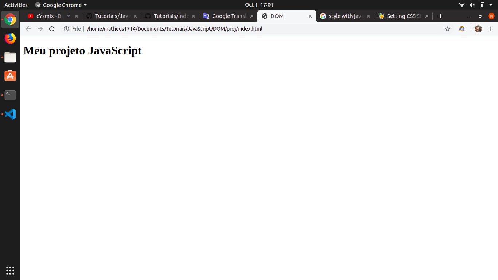
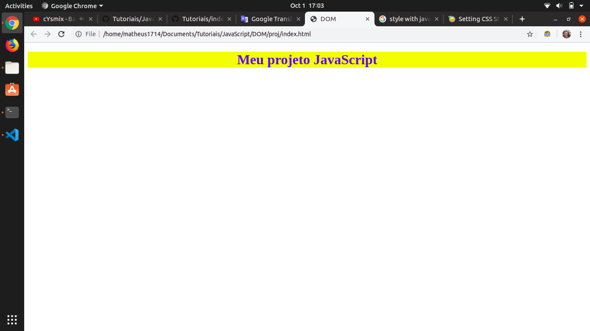
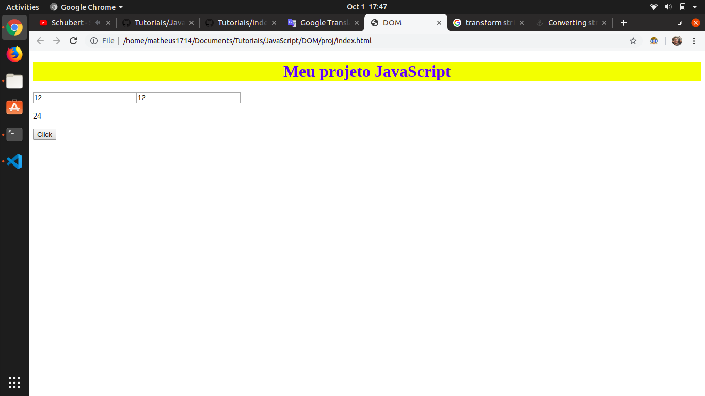

# Elementos com JavaScript

## Apresentação

Toda página da web reside dentro de uma janela do navegador que pode ser considerada como um objeto.

Um objeto Document representa o documento HTML que é exibido nessa janela. O objeto Documento possui várias propriedades que se referem a outros objetos que permitem acesso e modificação do conteúdo do documento.

A maneira como um conteúdo do documento é acessado e modificado é chamado de Document Object Model, ou DOM. Os objetos são organizados em uma hierarquia. Essa estrutura hierárquica se aplica à organização de objetos em um documento da Web.

Objeto      | Explicação
----------- | --------------
jabela      | Topo da hierarquia. É o elemento mais externo da hierarquia de objetos.
documento   | Cada documento HTML carregado em uma janela se torna um objeto de documento. O documento contém o conteúdo da página.
formulário  | Tudo incluído nas tags `<form>` ... `</form>` define o objeto de formulário.
controle de formulário | O objeto de formulário contém todos os elementos definidos para esse objeto, como campos de texto, botões, botões de opção e caixas de seleção.

Aqui está uma hierarquia simples de alguns objetos importantes: 


## Tutorial

Faremos um projeto de criação de elementos do DOM com JavaScript para treino de algumas funções importantes do JavaScript.

Comece criando uma pasta e entrado nela:

```sh
mkdir proj
cd proj
```

Agora criaremos as pastas `index.js` e `index.html`:

```sh
touch index.js
touch index.html
```

Coloque no `index.html` o seguinte código:

```html
<!DOCTYPE html>
<html lang="en">
    <head>
        <meta charset="UTF-8">
        <title>DOM</title>
    </head>
    <body>
        <script src="index.js"></script>
    </body>
</html>
```

Veja que trabalharemos apenas com o arquivo JavaScript para o projeto.

Começaremos criando uma tag h1 com o texto "Meu projeto JavaScript".

```js
// Get a DOM element body
body = document.getElementsByTagName("body")
// Create o DOM element
h1 = document.createElement("h1")
// Text in h1
textnode = "Meu projeto JavaScript"
// Put text in h1
h1.textContent = textnode
// connect element h1 on dom
body[0].appendChild(h1)
```

Você deve obter o resultado:



Veja que pegamos elemento body do DOM depois criamos a tag h1. Em seguida colocamos o texto mencionado e por ultimo ligamos o elemento h1 no body. Com o JavaScript podemos criar o html. Contudo, se tivéssimos escrito a tag h1 diretamente no html seria mais rápido e teria menos código, mas esse tutorial tem o objetivo de apresentar a contrução da págino com estilos apenas com JavaScript no intuito de mostrar o potencial da linguagem.

Agora adicionaremos alguns estilos nesse h1. Vamos deivar o h1 centralizado, colocar uma cor na nas letras e colocar outro tipo de letra:

```js
// Styles
h1.style.color = "blue"
h1.style.backgroundColor = "yellow"
h1.style.textAlign = "center"
```

Você deve obter o resultado:



O comportamento do estilo em JavaScript é semelhante ao css. Quando queremos adicionar um estilo colocamos o `style`. A forma de adicionar cores segue o padrão de declaração de variáveis em JavaScript que é a primeira palavra minuscula e as outras seguintes com a primeira letra maiuscula.

    nome1Nome2Nome3Nome4

Agora criaremos dois inputs que pegam dois números e devolvem como resultado a soma dos números escritos:

```js
// Create inputs
input1 = document.createElement("input")
input2 = document.createElement("input")

// Add type in inputs
input1.type = "number"
input2.type = "number"

// Create tag resp
resp   = document.createElement("p")


input1.classList.add("number1")
input2.classList.add("number2")

// connect elements in dom
body[0].appendChild(input1)
body[0].appendChild(input2)
body[0].appendChild(resp)

// Create button tag
button = document.createElement("button")

// Text in button
button.textContent = "Click"

// connect elements in dom
body[0].appendChild(button)

// If the button clicked
button.addEventListener("click", function(){
    // Get numbers
    number1 = document.getElementsByClassName("number1")
    number2 = document.getElementsByClassName("number2")
    // Sum numbers
    number3 = parseInt(number1[0].value) + parseInt(number2[0].value)
    // Change resp
    resp.textContent = number3
})
```

Você deve obter o resultado:



A lógica para o funcionamento desse código criar elementos, input1, input2, resp, button. Depois adicionar esses elementos no DOM. Ao evento de o botão ser clicado, pegue o resultado dos números e some. Depois adicione a soma em resp.

Foram utilizadas várias funçẽos para obter os elementos da página, como o parseInt(transformar strings em int), classList.add(adicionar classe à tag).

Fazer isso com arquivos css e tags html para fazer elementos são todos possíveis com JavaScript, mas é ineficiente.

A utilização dessas funções ocorre quando queremos adicionar uma classe de estilo css que não está no html, por exemplo.
## Referências

* [www.tutorialspoint.com](https://www.tutorialspoint.com/javascript/javascript_html_dom.htm)