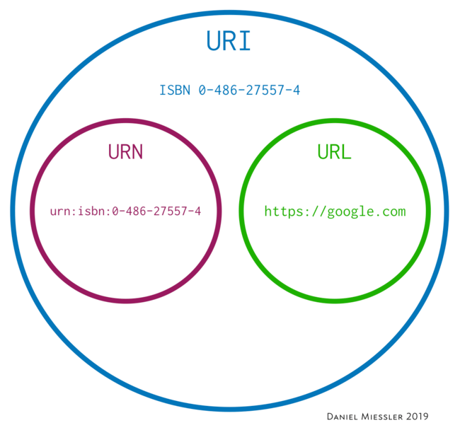

# REST

## Apresentação

Representational State Transfer, abreviado como REST, não é uma tecnologia, uma biblioteca, e nem tampouco uma arquitetura, mas sim um modelo a ser utilizado para se projetar arquiteturas de software distribuído, baseadas em comunicação via rede.

REST na verdade pode ser considerado como um conjunto de princípios, que quando aplicados de maneira correta em uma aplicação, a beneficia com a arquitetura e padrões da própria Web.

### Tutorial

#### Recursos

Toda aplicação gerencia algumas informações. Uma aplicação de um E-commerce, por exemplo, gerencia seus produtos, clientes, vendas, etc. Essas coisas que uma aplicação gerencia são chamadas de Recursos no modelo REST.

Um recurso nada mais é do que uma abstração sobre um determinado tipo de informação que uma aplicação gerencia, sendo que um dos princípios do REST diz que todo recurso deve possuir uma identificação única. Essa identificação serve para que a aplicação consiga diferenciar qual dos recursos deve ser manipulado em uma determinada solicitação.

A identificação do recurso deve ser feita utilizando-se o conceito de URI (Uniform Resource Identifier)

As URI’s são a interface de utilização dos seus serviços e funcionam como um contrato que será utilizado pelos clientes para acessá-los. 

Mais informações no link: [blog.caelum.com.br](https://blog.caelum.com.br/rest-principios-e-boas-praticas/)

#### Utilização dos métodos HTTP para manipulação dos recursos

Os recursos gerenciados por uma aplicação, e identificados unicamente por meio de sua URI, geralmente podem ser manipulados de diversas maneiras. É possível criá-los, atualizá-los, excluí-los, dentre outras operações.

Quando um cliente dispara uma requisição HTTP para um serviço, além da URI que identifica quais recursos ele pretende manipular, é necessário que ele também informe o tipo de manipulação que deseja realizar no recurso. É justamente aí que entra um outro conceito da Web, que são os métodos do protocolo HTTP.

O protocolo HTTP possui diversos métodos, sendo que cada um possui uma semântica distinta, e devem ser utilizados para indicar o tipo de manipulação a ser realizada em um determinado recurso.

Método      | Utilização
----------  | ----------
GET         | Obter os dados de um recurso.
POST        | Criar um novo recurso.
PUT         | Substituir os dados de um determinado recurso.
PATCH       | Atualizar parcialmente um determinado recurso.
DELETE      | Excluir um determinado recurso.
HEAD        | Similar ao GET, mas utilizado apenas para se obter os cabeçalhos de resposta, sem os dados em si.
OPTIONS     | Obter quais manipulações podem ser realizadas em um determinado recurso.

#### Suporte diferentes representações

É considerada uma boa prática o suporte a múltiplas representações em um serviço REST, pois isso facilita a inclusão de novos clientes. Ao suportar apenas um tipo de formato, um serviço REST limita seus clientes, que deverão se adaptar para conseguir se comunicar com ele.

Os três principais formatos suportados pela maioria dos serviços REST são:

* HTML;
* XML;
* JSON.

#### Utilização correta dos códigos HTTP

Na verdade, esse não é um princípio do REST, mas sim uma boa prática.

No protocolo HTTP, toda requisição feita por um cliente a um servidor deve resultar em uma resposta, sendo que nela existe um código HTTP, utilizado para informar o resultado da requisição, tenha ela sido processada com sucesso ou não.

Existem dezenas de códigos HTTP, cada um tendo sua semântica especifica e devendo ser utilizado quando fizer sentido. Os códigos HTTP são agrupados em classes, conforme demonstrado a seguir:

Classes      | Semântica
----------   | ----------
2xx          | Indica que a requisição foi processada com sucesso.
3xx          | Indica ao cliente uma ação a ser tomada para que a requisição possa ser concluída.
4xx          | Indica erro(s) na requisição causado(s) pelo cliente.
5xx          | Indica que a requisição não foi concluída devido a erro(s) ocorrido(s) no servidor.

Utilize o código correto para cada tipo de situação. Evite a má prática de sempre utilizar um mesmo código genérico para todas as situações, como por exemplo o código 200 para qualquer tipo de requisição bem-sucedida ou o código 500 para qualquer requisição malsucedida.

## Referências

* [blog.caelum.com.br](https://blog.caelum.com.br/rest-principios-e-boas-praticas/)