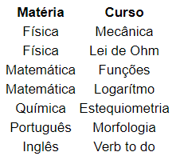

# Tutorial de TO DO List

## Apresentação

    O TODO List é uma maneira de trabalhar no FrontEnd com manipulação de Tags em JavaScript. Ela é importante para fazer tabelas dinâmicas com adição, deleção, alteração de linhas na tabela.
    Em um projeto completo, essa manupulação de conteúdos é feito por um Banco de Dados. Este é responsável por cuidar dos dados nas tabelas. A manipulação deste conteúdo é feito pelo desenvolvedor do Back-End.

## Tópicos Abordados

    1. Criar tabela com html
    2. 

## Tutorial

### Configurando o Projeto

Arquitetura do projeto:

    |--TODO
    |----index.html
    |----index.css
    |----index.js
    |----img
    |------favicon.png
    |----tutorial.md
Em cada arquivo teremos inicialmente os códigos
* index.html
```html
<!DOCTYPE html>
<html lang="en">
    <head>
        <meta charset="utf-8">
        <!-- Title in guide -->
        <title>TO DO List</title>
        <!-- Favicon in guide -->
        <link rel="icon" href="img/favicon.png" type="image/png">
        <!-- Link the file css in file html -->
        <link rel = "stylesheet" type = "text/css" href = "index.css" />
    </head>
    <body>
        <!-- Main project -->
        <main>
            
        </main>
        <!-- Link the file js in file html -->
        <script src="index.js"></script>
    </body>
</html>
```
### Criação de Lista no HTML
A nossa lista será de uma plataforma de educação que oferece cursos básicos para vestibular de todas as matérias. Cada curso terá sua respectiva matéria.
Em termos de tabelas, teremos o seguinte:

Matéria    | Curso
---------- | ----------
Física     | Mecânica
Física     | Lei de Ohm
Matemática | Funções
Matemática | Logarítmo
Química    | Estequiometria
Português  | Morfologia
Inglês     | Verb to do

Código para a tabela:

* index.html
```html
<main>
    <table>
        <tr>
            <th>Matéria</th>
            <th>Curso</th>
        </tr>
        <tr>
            <td>Física</td>
            <td>Mecânica</td>
        </tr>
        <tr>
            <td>Física</td>
            <td>Lei de Ohm</td>
        </tr>
        <tr>
            <td>Matemática</td>
            <td>Funções</td>
        </tr>
        <tr>
            <td>Matemática</td>
            <td>Logarítmo</td>
        </tr>
        <tr>
            <td>Química</td>
            <td>Estequiometria</td>
        </tr>
        <tr>
            <td>Português</td>
            <td>Morfologia</td>
        </tr>
        <tr>
            <td>Inglês</td>
            <td>Verb to do</td>
        </tr>
    </table>
</main>
```
No navegador teríamos:



A tabela criada possui 4 tipos de Tags importantes. A Tag table, que é responsável por dar o formato de tabela. A tag tr, que separa os elementos da tabela, a Tag th, que é responsável por dar o título da tabela e a Tag td, que são os elementos da tabela.

Além disso é necessário colocar botões e caixas de texto para adição de elementos na tabela.
* index.html
```html
<div>
    <input type="text" placeholder="matéria">
    <input type="text" placeholder="curso">
    <button>Adicionar</button>
</div>
```
No navegador teríamos:


Para podermos desenvolver a lógica do código devemos colocar algo nas Tags para fazer marcações no intuito de não mudar Tags iguais.

* index.html

```html
<main>
    <div id="addDiv">
        <input type="text" placeholder="matéria" id="matter">
        <input type="text" placeholder="curso" id="cource">
        <button onclick="newElement()" class="addBtn">Adicionar</button>
    </div>
    <table id="showTable">
        <tr>
            <th>Matéria</th>
            <th>Curso</th>
        </tr>
        <tr>
            <td>Física</td>
            <td>Mecânica</td>
        </tr>
        <tr>
            <td>Física</td>
            <td>Lei de Ohm</td>
        </tr>
        <tr>
            <td>Matemática</td>
            <td>Funções</td>
        </tr>
        <tr>
            <td>Matemática</td>
            <td>Logarítmo</td>
        </tr>
        <tr>
            <td>Química</td>
            <td>Estequiometria</td>
        </tr>
        <tr>
            <td>Português</td>
            <td>Morfologia</td>
        </tr>
        <tr>
            <td>Inglês</td>
            <td>Verb to do</td>
        </tr>
    </table>
</main>
```
Com as marcações criadas agora podemos criar as funcionalidades da lista.

### Implementando Funcionalidades Principais da Lista
A primeira funcioalidade importante é adição de elementos.
* index.js
```js
// Create a new line item in table when clicking on the "Adicionar" button
function newElement(){
    // Create elements tr and td
    let tr = document.createElement("tr");
    let matterTd = document.createElement("td");
    let courceTd = document.createElement("td");
    // Get elements in input tag
    let matter = document.getElementById("matter").value;
    let cource = document.getElementById("cource").value;
    // Transform elements in input at text
    let matterTxt = document.createTextNode(matter);
    let courceTxt = document.createTextNode(cource);
    // Add element in td tag
    matterTd.appendChild(matterTxt);
    courceTd.appendChild(courceTxt);
    // Add element in tr tag
    tr.appendChild(matterTd);
    tr.appendChild(courceTd);
    // Verify null elements or add elements in table
    if(matter == '' || cource == ''){
        alert("Você deve escrever algo!");
    }else{
        document.getElementsByTagName("tbody")[0].appendChild(tr);
    }
    // Erase variables in inputs
    document.getElementById("matter").value = "";
    document.getElementById("cource").value = "";
}
```
A lógica de adição de elementos é pegar os valores de input das Tags e alocá-las em Tags da tabela. No início do código utilizamos a variável tr para representar uma Tag tr. Depois declaramos as Tags matterTd e courceTd para serem as Tags de cada coluna da tabela.
Depois utilizamos o appendChild para adicionar os elementos matter e cource na Tag tr.
Ao final do processo, esvasiamos o valor dos inputs.

A segunda funcionlidade é a deleção de elementos. Vamos fazer isso quando o usuário apertar um botão de remover um elemento a partir do índiece.
* index.html
```html
<div id="removeDiv">
    <input type="text" placeholder="index" id="index">
    <button onclick="removeElement()" class="removeBtn">Remover</button>
</div>
```
* index.js
```js
// Delete elements in table
function removeElement(){
    // Get element in input tag
    let index = document.getElementById("index").value;
    // Get elements in tag 
    let tbody = document.getElementsByTagName("tbody")[0];
    let tr = document.getElementsByTagName("tr");
    // Verify index value
    if(index => tr.length || index < 1){
        alert("A deleção é impossível");
    }else{
        tbody.removeChild(tr[index]);
    }
    // Erase variables in inputs
    document.getElementById("index").value = "";
}
```

## Referências

* [w3schools.com](https://www.w3schools.com/howto/howto_js_todolist.asp)