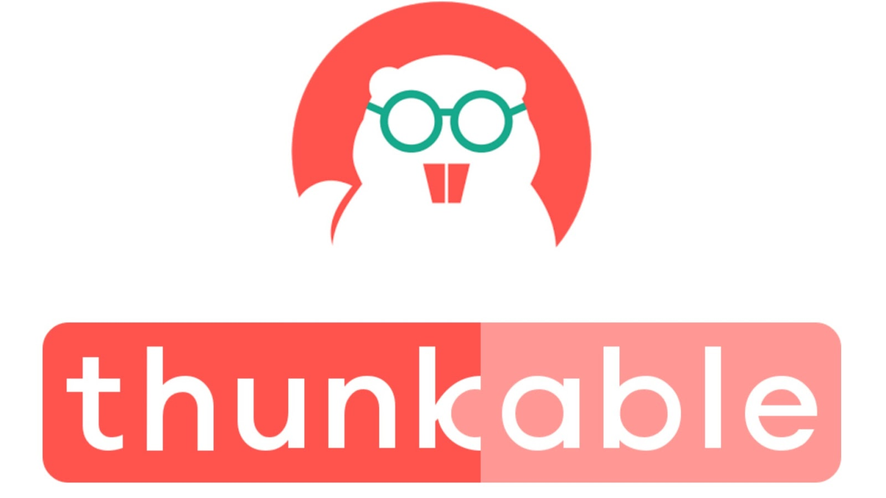

# Thunkable

## Apresentação

Thunkable facilita a criação de aplicativos iOS para todos. Thunkable é uma plataforma de arrastar e soltar para aplicativos móveis nativos de construção sem nenhuma codificação necessária.

O thunkable possui o teste ao vivo que é a capacidade de alterar e atualizar seu aplicativo em tempo real com as alterações feitas na plataforma (ios.thunkable.com).

## Referências

* [apps.apple.com](https://apps.apple.com/us/app/thunkable-live/id1223262700)
* [thunkable.com](https://thunkable.com/?gclid=Cj0KCQjwoebsBRCHARIsAC3JP0KMyhlXdhQXiBsZ2G2UWRpUriDXno1If6D-ECPXm2fFQJ8csfmd4fQaAkcBEALw_wcB#/)
